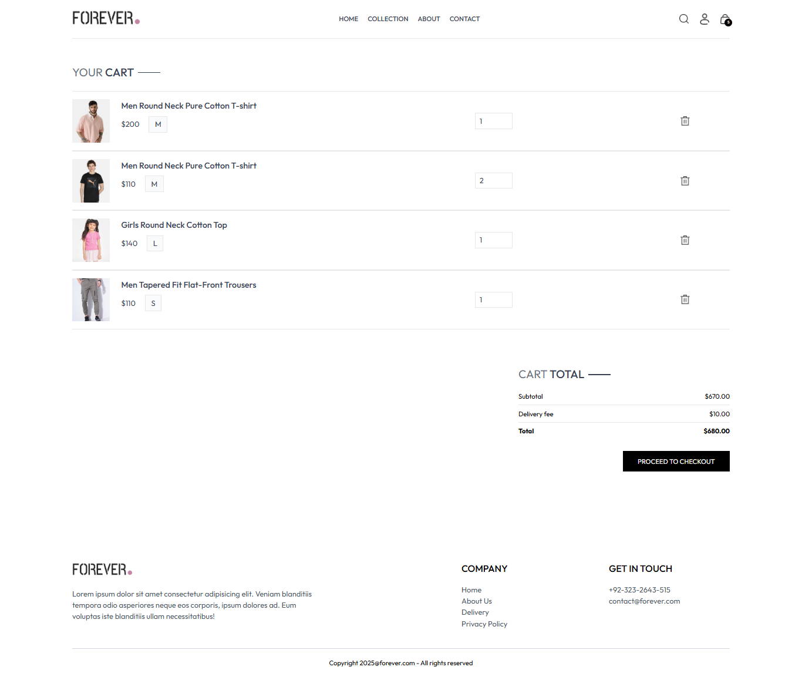
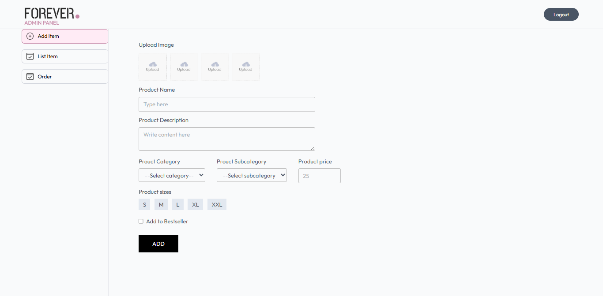

# 🛒 E-Commerce Website  

  
  
  
  
  
  

A **full-stack e-commerce web application** built with modern technologies.  
It includes **user authentication, product management, cart & order features, and an admin panel**.  

---

## 📸 Screenshots

  
  
  


---

## ✨ Features

- 🔐 User registration, login & logout  
- 🛍️ Browse products with categories  
- ➕ Add to cart, update, remove items  
- 📦 Place orders & view order history  
- 🛠️ Admin: add / update / delete products  
- 📱 Responsive UI for mobile & desktop  
- ⚡ Fast API and database integration  

---

## 🛠️ Tech Stack

| Layer        | Technology |
|--------------|------------|
| **Frontend** | React, Tailwind CSS |
| **Backend**  | Node.js, Express |
| **Database** | MongoDB (Mongoose) |
| **Auth**     | JWT Authentication |
| **Other**    | REST API, dotenv, bcrypt, etc. |

---

## 📂 Project Structure

```
ecommerce-website/
│
├── backend/               # Backend server / API
│   ├── controllers/
│   ├── models/
│   ├── routes/
│   ├── config/
│   └── server.js
│
├── frontend/              # React frontend
│   ├── src/components/
│   ├── src/pages/
│   └── App.js
│
├── README.md
└── .gitignore
```

---

## 🚀 Installation & Setup

### Prerequisites
- Node.js & npm installed  
- MongoDB running locally or Atlas cloud connection  

### Backend Setup
```bash
cd backend
npm install
```

Create `.env` file inside `backend/`:
```
PORT=4000
MONGODB_URI=your_mongodb_connection
CLOUDINARY_API_KEY=your_api_key
CLOUDINARY_SECRET_KEY=your_secret_key
CLOUDINARY_NAME=your_cloudinary_name
JWT_SECRET_KEY=your_jwt_secret
ADMIN_EMAIL=your_admin_email
ADMIN_PASSWORD=your_admin_password
STRIPE_SECRET_KEY=your_stripe_secret
```

Run backend:
```bash
npm run dev
```
Backend will run at → http://localhost:4000


### Frontend Setup
```bash
cd frontend
npm install
npm start
```

Open your browser → `http://localhost:5173` 🎉

---

## 📡 API Endpoints

| Method | Route               | Description        |
|--------|---------------------|--------------------|
| POST   | /api/user/register  | Register new user  |
| POST   | /api/user/login     | Login user         |
| GET    | /api/product/list   | Get all products   |
| POST   | /api/product/single | Get single product |
| POST   | /api/cart           | Add item to cart   |
| POST   | /api/order          | Place new order    |

---

## 🤝 Contributing

Contributions are welcome!  

1. Fork the repo  
2. Create your branch (`git checkout -b feature/YourFeature`)  
3. Commit changes (`git commit -m 'Add feature'`)  
4. Push branch (`git push origin feature/YourFeature`)  
5. Create a Pull Request  

---

## 👤 Author

**Aazim Sherazi**  
- GitHub: [@aazimsherazi19](https://github.com/aazimsherazi19)  
- Project Link: [E-Commerce Website](https://github.com/aazimsherazi19/ecommerce-website)  
